# Anne's Sketches

## Fibonacci
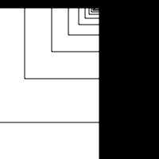
[drawing 1](Anne/Schets/Fibonacci_1.pv)

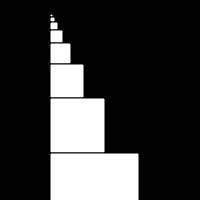
[drawing 1](Anne/Schets/Fibonacci_2.pv)

[drawing 1](Anne/Schets/Fibonacci_3.pv)

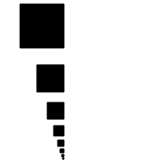
[drawing 1](Anne/Schets/Fibonacci_4.pv)

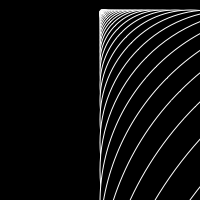
[drawing 1](Anne/Schets/Fibonacci_5.pv)

## Random
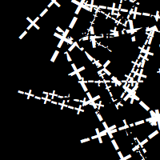
[drawing 1](Anne/Schets_2/random_1.pv)

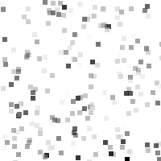
[drawing 1](Anne/Schets_2/Random_2.pv)

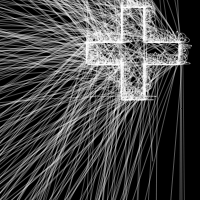
[drawing 1](Anne/Schets_2/Random_3.pv)

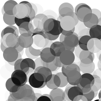
[drawing 1](Anne/Schets_2/Random_5.pv)

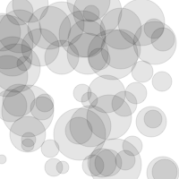
[drawing 1](Anne/Schets_2/Random_7.pv)

## Perlin Noise
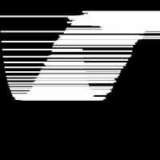
[drawing 1](Anne/Schets_3/Perlin_Noise_1.pv)

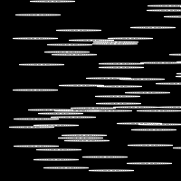
[drawing 1](Anne/Schets_3/Perlin_Noise_6.pv)

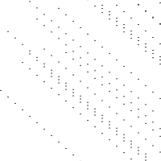
[drawing 1](Anne/Schets_3/Perlin_Noise_3.pv)

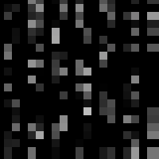
[drawing 1](Anne/Schets_3/Perlin_Noise_4.pv)

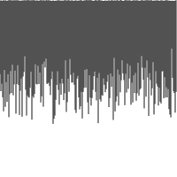
[drawing 1](Anne/Schets_3/Perlin_Noise_5.pv)

## Recursive functions
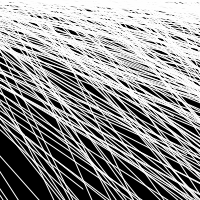
[drawing 1](Anne/Schets_4/Recursive_functions_1.pv)

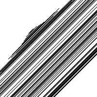
[drawing 1](Anne/Schets_4/Recursive_functions_2.pv)

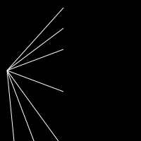
[drawing 1](Anne/Schets_4/Recursive_functions_3.pv)

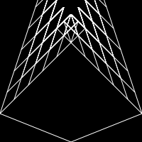
[drawing 1](Anne/Schets_4/Recursive_functions_4.pv)

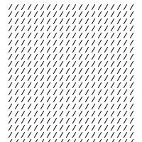
[drawing 1](Anne/Schets_4/Recursive_functions_5.pv)

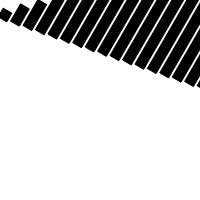
[drawing 1](Anne/Schets_4/Recursive_functions_6.pv)

