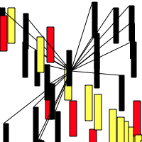
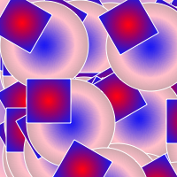
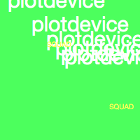
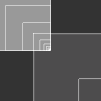
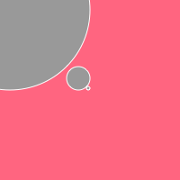

# Bas's Sketches

## Fibonacci
[tekening1](Bas/Code1.pv)
[tekening2](Bas/Code2.pv)
[tekening3](Bas/Code3.pv)
[tekening4](Bas/Code4.pv)
[tekening5](Bas/Code5.pv)
[tekening6](Bas/Code6.pv)
[tekening7](Bas/Code7.pv)
## Perlin Noise

## Recursive functions
            
