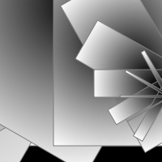

# Bas's Sketches

## Fibonacci
[Schets1](Bas/Fibonacci/fibonacci_1.pv)
[Schets2](Bas/Fibonacci/fibonacci_2.pv)
[Schets3](Bas/Fibonacci/fibonacci_3.pv)
[Schets4](Bas/Fibonacci/fibonacci_4.pv)
[Schets5](Bas/Fibonacci/fibonacci_5.pv)
[Schets6](Bas/Fibonacci/fibonacci_6.pv)

## Random
[Schets1](Bas/Random/random_1.pv)
[Schets2](Bas/Random/random_2.pv)
[Schets3](Bas/Random/random_3.pv)
[Schets4](Bas/Random/random_4.pv)
[Schets5](Bas/Random/random_5.pv)
[Schets6](Bas/Random/random_6.pv)

## Perlin Noise
[Schets1](Bas/PerlinNoise/Code_noise1.pv)
[Schets2](Bas/PerlinNoise/Code_noise2.pv)
[Schets3](Bas/PerlinNoise/Code_noise3.pv)
[Schets4](Bas/PerlinNoise/Code_noise4.pv)
[Schets5](Bas/PerlinNoise/Code_noise5.pv)

## Recursive functions
[Schets1](Bas/RF/RF_Schets1.pv)
[Schets2](Bas/RF/RF_Schets2.pv)
[Schets3](Bas/RF/RF_Schets3.pv)
[Schets4](Bas/RF/RF_Schets4.pv)
[Schets5](Bas/RF/RF_Schets5.pv)
[Schets6](Bas/RF/RF_Schets6.pv)
[Schets7](Bas/RF/RF_Schets7.pv)
[Schets8](Bas/RF/RF_Schets8.pv)
[Schets9](Bas/RF/RF_Schets9.pv)
[Schets10](Bas/RF/RF_Schets10.pv)
[Schets11](Bas/RF/RF_Schets11.pv)
[Schets12](Bas/RF/RF_Schets12.pv)

