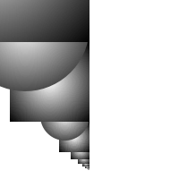
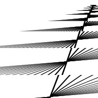
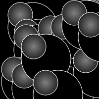
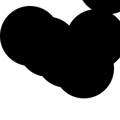
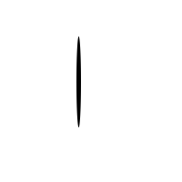
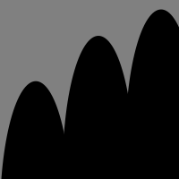

# Esmee's Sketches

## Fibonacci

[drawning 1](Esmee/schets1/drawning1.pv)

[drawning 2](Esmee/schets1/drawning2.pv)

[drawning 3](Esmee/schets1/drawning3.pv)

[drawning 4](Esmee/schets1/drawning4.pv)

[drawning 5](Esmee/schets1/drawning5.pv)

[drawning 6](Esmee/schets1/drawning6.pv)

[drawning 7](Esmee/schets2/drawning7.pv)

[drawning 8](Esmee/schets2/drawning8.pv)

[drawning 9](Esmee/schets2/drawning9.pv)

[drawning 10](Esmee/schets2/drawning10.pv)

[drawning 11](Esmee/schets2/drawning11.pv)

## Perlin Noise

[drawning 1](Esmee/schets3/01_noise.pv)

[drawning 2](Esmee/schets3/02_noise.pv)

[drawning 3](Esmee/schets3/03_noise.pv)

[drawning 4](Esmee/schets3/03_noise-k.pv)

[drawning 5](Esmee/schets3/04_noise.pv)

[drawning 6](Esmee/schets3/04_noise-k.pv)

[drawning 7](Esmee/schets3/05_noise.pv)

## Recursive functions
            
