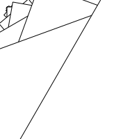
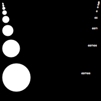
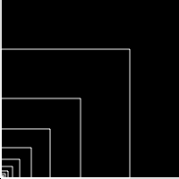
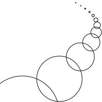
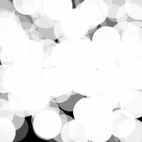
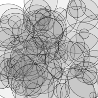
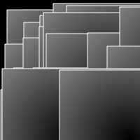
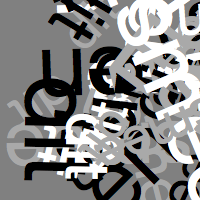

# Esmee's Sketches

## Fibonacci

[drawning 1](schets1/drawning1.pv)

[drawning 2](schets1/drawning2.pv)

[drawning 3](schets1/drawning3.pv)

[drawning 4](schets1/drawning4.pv)

[drawning 5](schets1/drawning5.pv)

[drawning 6](schets1/drawning6.pv)

[drawning 10](schets2/drawning10.pv)

[drawning 11](schets2/drawning11.pv)

[drawning 12](schets2/drawning12.pv)

[drawning 13](schets2/drawning13.pv)

[drawning 14](schets2/drawning14.pv)

## Perlin Noise

## Recursive functions
            
