# Floris's Sketches

## Fibonacci
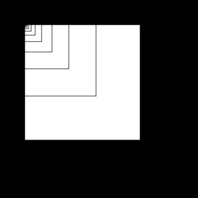[fibo 1](Floris/fibo_1.pv)
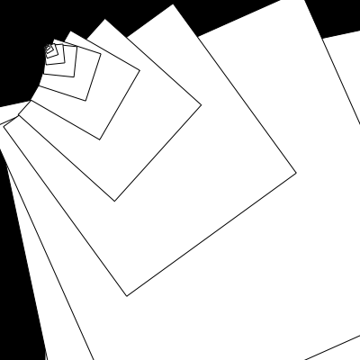[fibo 2](Floris/fibo_2.pv)
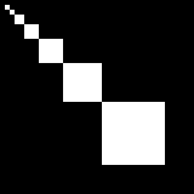[fibo 3](Floris/fibo_3.pv)
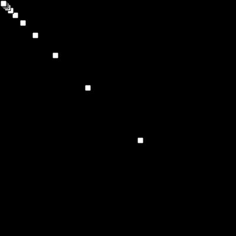[fibo 4](Floris/fibo_4.pv)
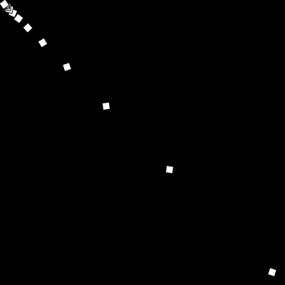[fibo 5](Floris/fibo_5.pv)

## Random
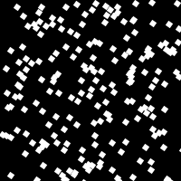[random 1](Floris/random_1.pv)
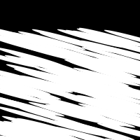[random 2](Floris/random_2.pv)
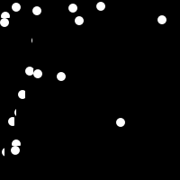[random 3](Floris/random_3.pv)
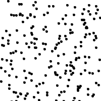[random 4](Floris/random_4.pv)
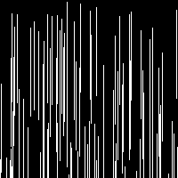[random 5](Floris/random_5.pv)

## Perlin Noise
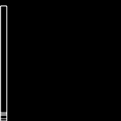[perlin 1](Floris/perlin_1.pv)
[perlin 2](Floris/perlin_2.pv)
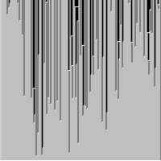[perlin 3](Floris/perlin_3.pv)
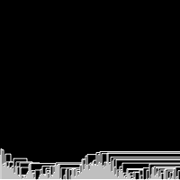[perlin 4](Floris/perlin_4.pv)
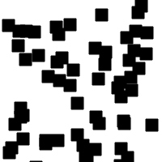[perlin 5](Floris/perlin_5.pv)

## Recursive functions
            
