# Heike's sketches
Personal Work for the Algorithmic Nature assignment

##Fibonacci
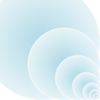
[c o d e](Heike/fibonacci/fibonacci2.pv)

##Random
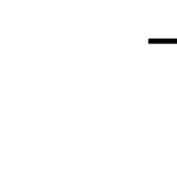

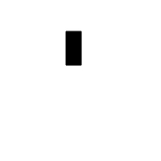

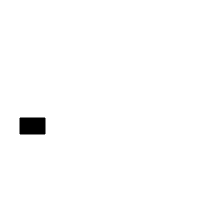
[c o d e](Heike/random/iets.pv)
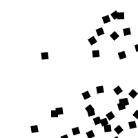
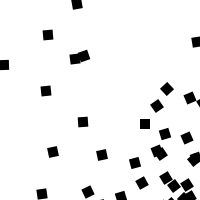
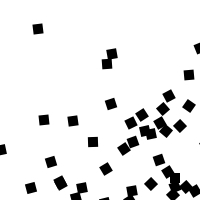
[c o d e](Heike/random/random_rotated_squares.pv)
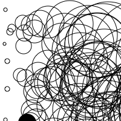
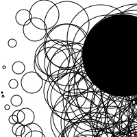
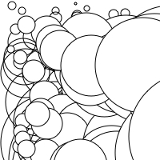
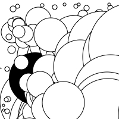
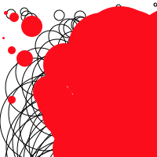
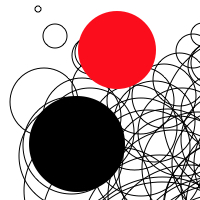
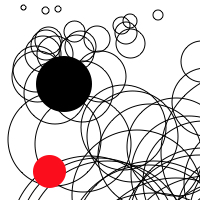
[c o d e](Heike/random/random_circles.pv)

##Perlin Noise
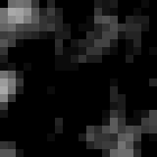
[c o d e](perlin_noise/noise_clouds.pv)
##Recrusive Function
