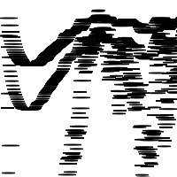

# Ilse B's Sketches

## Fibonacci

[code](Ilse_B/fibonacci/fib1.pv)

[code](Ilse_B/fibonacci/fib2.pv)

[code](Ilse_B/fibonacci/fib3.pv)

[code](Ilse_B/fibonacci/fib4.pv)

[code](Ilse_B/fibonacci/fib5.pv)

## Random

[code](Ilse_B/random/random1.pv)

[code](Ilse_B/random/random2.pv)

[code](Ilse_B/random/random3.pv)

[code](Ilse_B/random/random4.pv)

[code](Ilse_B/random/random5.pv)

## Perlin Noise

[code](Ilse_B/perlin/perlin1.pv)

[code](Ilse_B/perlin/perlin2.pv)

[code](Ilse_B/perlin/perlin3.pv)

[code](Ilse_B/perlin/perlin4.pv)

[code](Ilse_B/perlin/perlin5.pv)

## Recursive functions

[code](Ilse_B/rf/rf1.pv)

[code](Ilse_B/rf/rf2.pv)

[code](Ilse_B/rf/rf3.pv)

[code](Ilse_B/rf/rf4.pv)

[code](Ilse_B/rf/rf5.pv)