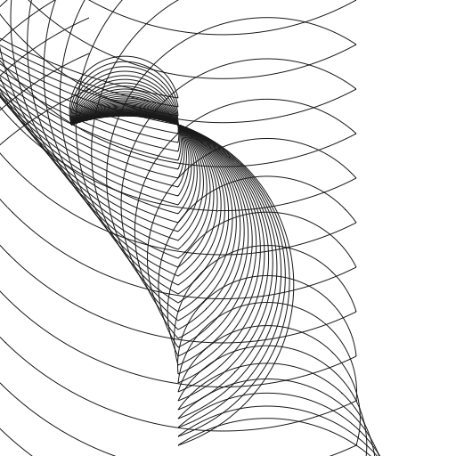
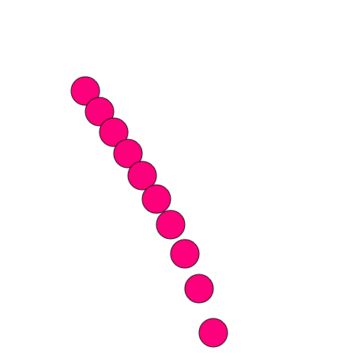
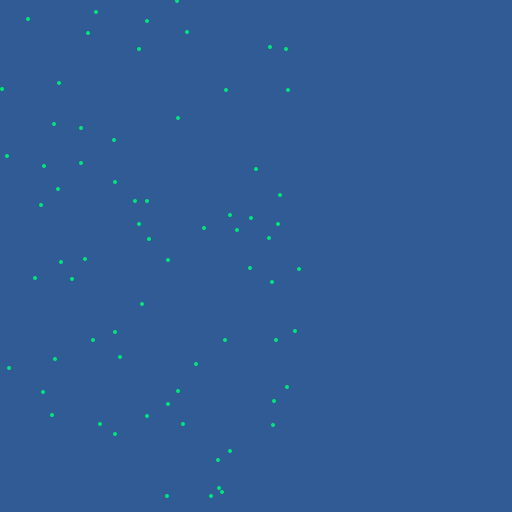
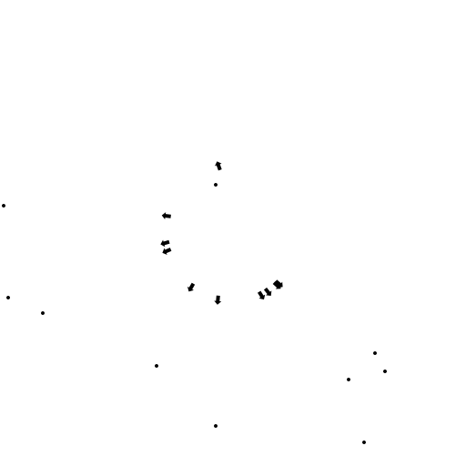
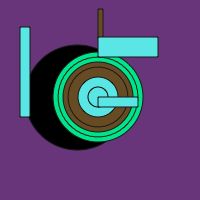
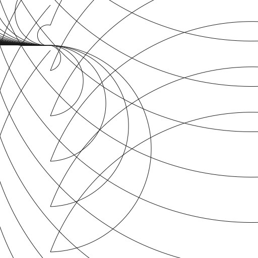
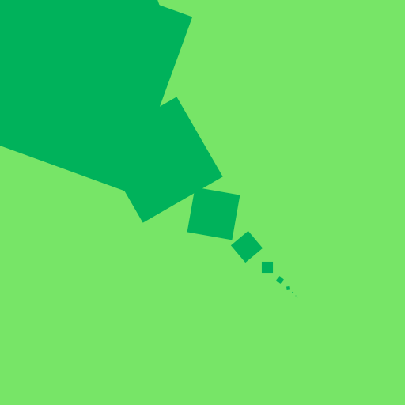
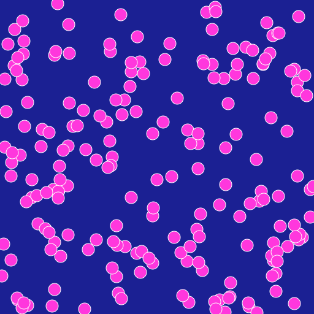
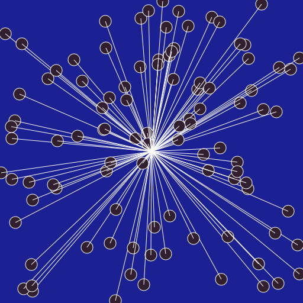
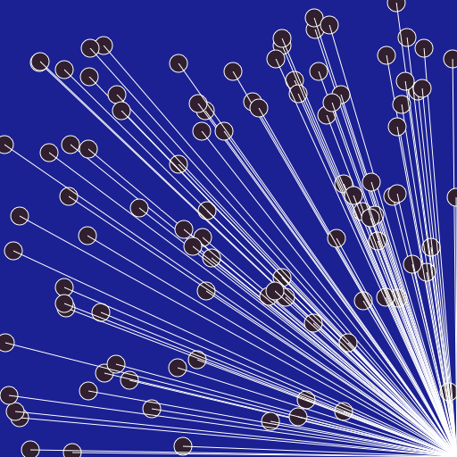

# Ilse Z's Sketches

## Fibonacci

[drawing 1](Ilse_Z/schetsen1/Drawing_01_test.pv)

[drawing 1](Ilse_Z/schetsen1/Drawing_02_arcto.pv)

[drawing 1](Ilse_Z/schetsen1/Drawing_02_fibonacciCirkel.pv)

[drawing 1](Ilse_Z/schetsen1/Drawing_04_bolletjes.pv)

[drawing 1](Ilse_Z/schetsen1/Drawing_05_random.pv)

[drawing 1](Ilse_Z/schetsen2/fibbonacci_1.pv)

[drawing 1](Ilse_Z/schetsen2/fibbonacci_2.pv)

[drawing 1](Ilse_Z/schetsen2/fibbonacci_3.pv)

[drawing 1](Ilse_Z/schetsen2/fibbonacci_4.pv)

[drawing 1](Ilse_Z/schetsen2/fibbonacci_5.pv)

[drawing 1](Ilse_Z/schetsen2/fibbonacci_6.pv)

## Perlin Noise

## Recursive functions
            
