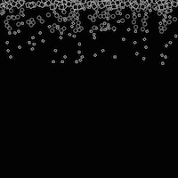
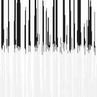
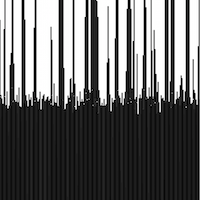
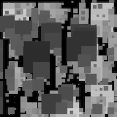

# Isabel's Sketches

## Fibonacci

## Random

[random1](Isabel/random1.pv)

[random2](Isabel/random1.1.pv)

[random3](Isabel/random3.pv)

[random4](Isabel/random4.pv)

[random5](Isabel/random5.pv)

## Perlin Noise

[perlin1](Isabel/3.pv)

[perlin2](Isabel/2.3.pv)

[perlin4](Isabel/4.1.pv)

[perlin5](Isabel/2.3.pv)

[perlin6](Isabel/4.2.pv)

## Recursive functions
            

[recursive17](Isabel/19.2.pv)

[recursive19](Isabel/19.5.pv)

[recursive20](Isabel/19.6.pv)

[recursive21](Isabel/19.7.pv)

[recursive22](Isabel/19.9.pv)