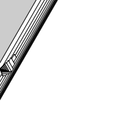
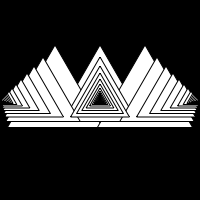
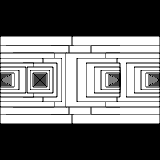
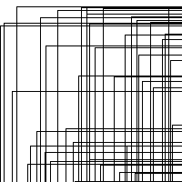
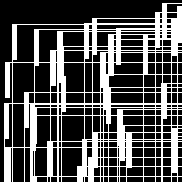
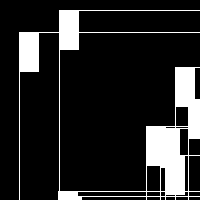
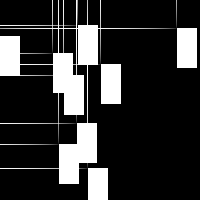
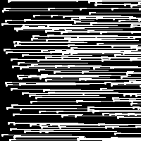

# Jeanine's Sketches

## Fibonacci

[sketch_01](Jeanine/Fibonacci/Fibonacci_sketch_01.pv)
[sketch_02](Jeanine/Fibonacci/Fibonacci_sketch_02.pv)

## Random

[sketch_01](Jeanine/Random/Random_sketch_01.pv)
[sketch_02](Jeanine/Random/Random_sketch_02.pv)
[sketch_03](Jeanine/Random/Random_sketch_03.pv)

## Perlin Noise

## Recursive functions
            
