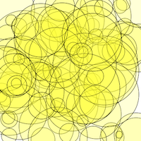
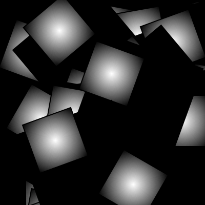
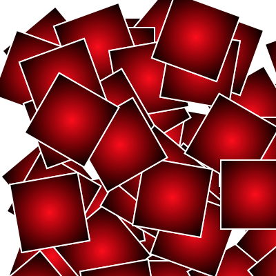
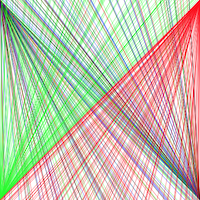
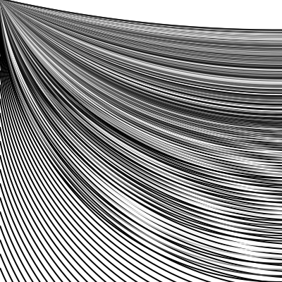

# Jesse's Sketches

## Fibonacci

[random 2](Jesse/random/schets2.pv)

[random 4](Jesse/Fibonacci/schets4.pv)
[random 5](Jesse/Fibonacci/schets5.pv)

## Perlin Noise
 [perlin 1](Jesse/Fibonacci/perlinnoise_1.pv)
[perlin 2](Jesse/Fibonacci/perlinnoise_2.pv)
[perlin 3](Jesse/Fibonacci/perlinnoise_3.pv)
[perlin 4](Jesse/Fibonacci/perlinnoise_4.pv)
[perlin 5](Jesse/Fibonacci/perlinnoise_5.pv)
[perlin 6] (Jesse/Fibonacci/perlinnoise_6.pv)

## Recursive functions
            
