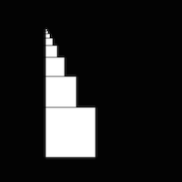
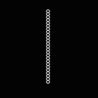
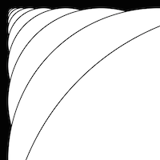
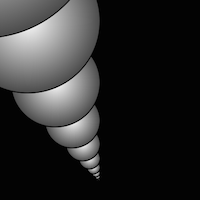
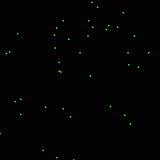
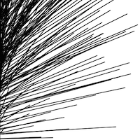

# Jesse's Sketches

## Fibonacci
<<<<<<< HEAD

[random 2](Jesse/random/schets2.pv)

[random 4](Jesse/Fibonacci/schets4.pv)
[random 5](Jesse/Fibonacci/schets5.pv)
=======

[fibonacci 1](Jesse/fibonacci/fib1.pv)
[fibonacci 2](Jesse/fibonacci/fib2.pv)
[fibonacci 3](Jesse/fibonacci/fib3.pv)
[fibonacci 4](Jesse/fibonacci/fib4.pv)
[fibonacci 5](Jesse/fibonacci/fib5.pv)

>>>>>>> origin/master

## Random

[random 1](Jesse/random/random1.pv)
[random 2](Jesse/random/random2.pv)
[random 3](Jesse/random/random3.pv)
[random 4](Jesse/random/random4.pv)
[random 5](Jesse/random/random5.pv)

## Perlin Noise
<<<<<<< HEAD
 [perlin 1](Jesse/Fibonacci/perlinnoise_1.pv)
[perlin 2](Jesse/Fibonacci/perlinnoise_2.pv)
[perlin 3](Jesse/Fibonacci/perlinnoise_3.pv)
[perlin 4](Jesse/Fibonacci/perlinnoise_4.pv)
[perlin 5](Jesse/Fibonacci/perlinnoise_5.pv)
[perlin 6] (Jesse/Fibonacci/perlinnoise_6.pv)
=======

[perlinnoise 1](Jesse/perlinnoise/perlinnoise_1.pv)
[perlinnoise 2](Jesse/perlinnoise/perlinnoise_2.pv)
[perlinnoise 3](Jesse/perlinnoise/perlinnoise_3.pv)
[perlinnoise 4](Jesse/perlinnoise/perlinnoise_4.pv)
[perlinnoise 5](Jesse/perlinnoise/perlinnoise_5.pv)
[perlinnoise 6](Jesse/perlinnoise/perlinnoise_6.pv)
>>>>>>> origin/master

## Recursive functions
                        

[recursivefunctions 1](Jesse/recursivefunctions/function1.pv)

[recursivefunctions 2](Jesse/recursivefunctions/function2.pv)

[recursivefunctions 3](Jesse/recursivefunctions/function3.pv)

[recursivefunctions 4](Jesse/recursivefunctions/function4.pv)

[recursivefunctions 5](Jesse/recursivefunctions/function5.pv)