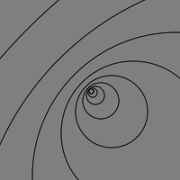

# Kimberley's Sketches

## Fibonacci

**Les 1**

[drawing 1](Kimberley/sketchesles1/fib1.pv)

[drawing 1](Kimberley/sketchesles1/fib2.pv)

[drawing 1](Kimberley/sketchesles1/fib3.pv)

[drawing 1](Kimberley/sketchesles1/fib4.pv)

[drawing 1](Kimberley/sketchesles_1/fib5.pv)

**Les 2**

[drawing 1](Kimberley/sketches_les_2/Les-02-Random.pv)

[drawing 1](Kimberley/sketches_les_2/Les-02-Random.pv)

[drawing 1](Kimberley/sketches_les_2/Les-02-Random.pv)

## Perlin Noise

## Recursive functions
            
