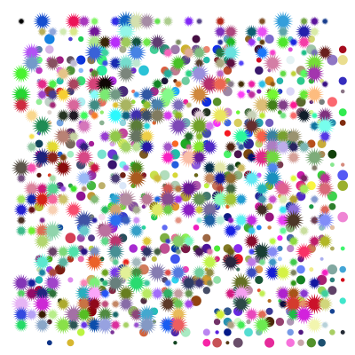

# Kimberley's Sketches

## Fibonacci

[drawing 1](Kimberley/fibonacci/fib1.pv)

[drawing 2](Kimberley/fibonacci/fib2.pv)

[drawing 3](Kimberley/fibonacci/fib3.pv)

[drawing 4](Kimberley/fibonacci/fib4.pv)

[drawing 5](Kimberley/fiboanacci/fib5.pv)

## Random

[drawing 1](Kimberley/random/random1.pv)

[drawing 2](Kimberley/random/random2.pv)

[drawing 3](Kimberley/random/random3.pv)

[drawing 4](Kimberley/random/random4.pv)

[drawing 5](Kimberley/random/random5.pv)

## Perlin Noise

[drawing 1](Kimberley/perlinnoise/perlinnoise01.pv)

[drawing 2](Kimberley/perlinnoise/perlinnoise02.pv)

[drawing 3](Kimberley/perlinnoise/perlinnoise03.pv)

[drawing 4](Kimberley/perlinnoise/perlinnoise04.pv)

[drawing 5](Kimberley/perlinnoise/perlinnoise05.pv)
## Recursive functions
k
            
