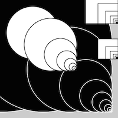
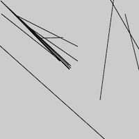
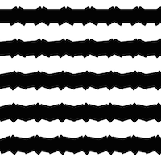
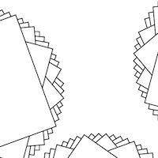
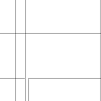
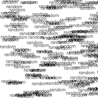
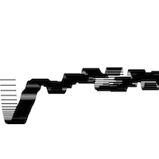
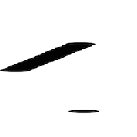
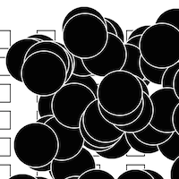

# Leonie's Sketches

## Fibonacci

[drawing 1](Leonie/fibonacci1pv.pv)

[drawing 1](Leonie/fibonacci2pv.pv)

[drawing 1](Leonie/fibonacci3pv.pv)

[drawing 1](Leonie/fibonacci4pv.pv)

[drawing 1](Leonie/fibonacci5pv.pv)

## Random

[drawing 1](Leonie/random2_text.pv)

## Perlin Noise

## Recursive functions
            
