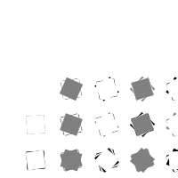

# Lola's Sketches

## Fibonacci

[klik hier](Lola/fibonachi/1.pv)

[klik hier](Lola/fibonachi/2.pv)

[klik hier](Lola/fibonachi/3.pv)

[klik hier](Lola/fibonachi/4.pv)

[klik hier](Lola/fibonachi/5.pv)

[klik hier](Lola/fibonachi/6.pv)

## Random

[klik hier](Lola/random/1.pv)

[klik hier](Lola/random/2.pv)

[klik hier](Lola/random/3.pv)

[klik hier](Lola/random/4.pv)

[klik hier](Lola/random/5.pv)

[klik hier](Lola/random/6.pv)

## Perlin Noise

[klik hier](Lola/perlin_noise/1.pv)

[klik hier](Lola/perlin_noise/2.pv)

[klik hier](Lola/perlin_noise/3.pv)

[klik hier](Lola/perlin_noise/4.pv)

[klik hier](Lola/perlin_noise/5.pv)

[klik hier](Lola/perlin_noise/6.pv)

[klik hier](Lola/perlin_noise/7.pv)

[klik hier](Lola/perlin_noise/8.pv)

## Recursive functions

[klik hier](Lola/recursive/1.pv)

[klik hier](Lola/recursive/2.pv)

[klik hier](Lola/recursive/3.pv)

[klik hier](Lola/recursive/4.pv)

[klik hier](Lola/recursive/5.pv)

[klik hier](Lola/recursive/6.pv)

[klik hier](Lola/recursive/7.pv)

[klik hier](Lola/recursive/8.pv)

[klik hier](Lola/recursive/9.pv)

[klik hier](Lola/recursive/10.pv)