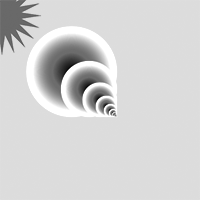

# Lydienne's Sketches

## Fibonacci

[drawing.1](Lydienne/drawing.1.png)

[drawing.2](Lydienne/drawing.2.png)

[drawing.3](Lydienne/drawing.3.png)

[drawing.4](Lydienne/drawing.4.png)

[drawing.5](Lydienne/drawing.5.png)

[drawing.6](Lydienne/drawing.6.png)

[drawing.8](Lydienne/drawing.8.png)

[drawing.10](Lydienne/drawing.10.png)

## Perlin Noise

## Recursive functions
            
