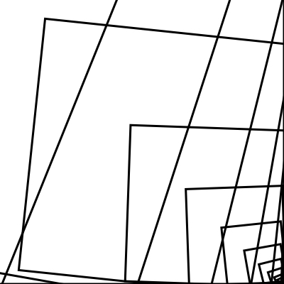
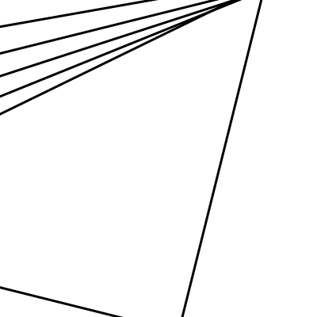
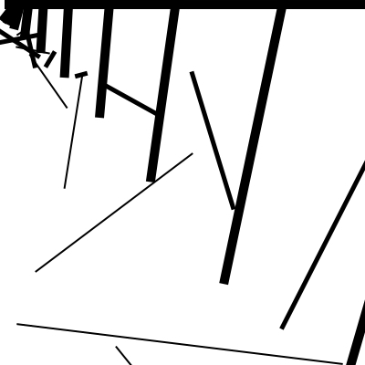
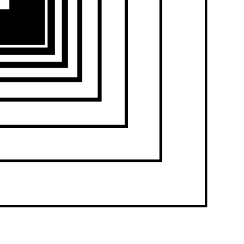
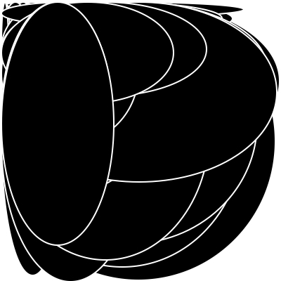
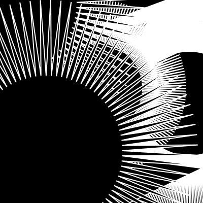

# Marleen's Sketches

## Fibonacci
 
[drawing 1](Marleen/01Fibo/Fibonacci2.pv)
 
[drawing 2](Marleen/01Fibo/Fibonacci4.pv)
 
[drawing 3](Marleen/01Fibo/Fibonacci6.pv)
 
[drawing 4](Marleen/01Fibo/Fibonacci8.pv)
 
[drawing 5](Marleen/01Fibo/Fibonacci9.pv)

## Random
 
[drawing 1](Marleen/01Fibo/ArtEZ_DM_Random_1.pv)
 
[drawing 2](Marleen/01Fibo/ArtEZ_DM_Random_2.pv)
 
[drawing 3](Marleen/01Fibo/ArtEZ_DM_Random_3.pv)
 
[drawing 4](Marleen/01Fibo/ArtEZ_DM_Random_4.pv)

## Perlin Noise

## Recursive functions
            
