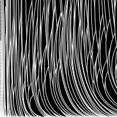

# Max's Sketches

## Fibonacci
[Fibonacci 1](Max/fib_01.pv)
[Fibonacci 2](Max/fib_02.pv)
[Fibonacci 3](Max/fib_03.pv)
[Fibonacci 4](Max/fib_04.pv)
[Fibonacci 5](Max/fib_05.pv)

## Random
[Random 1](Max/schets_random_01.pv)
[Random 2](Max/schets_random_02.pv)
[Random 3](Max/schets_random_03.pv)
[Random 4](Max/schets_random_04.pv)
[Random 5](Max/schets_random_05.pv)

## Perlin Noise
[Perlin 1](Max/perlinnoise_01.pv)
[Perlin 2](Max/perlinnoise_02.pv)
[Perlin 3](Max/perlinnoise_03.pv)
[Perlin 4](Max/perlinnoise_04.pv)
[Perlin 5](Max/perlinnoise_05.pv)
[Perlin 6](Max/perlinnoise_06.pv)

## Recursive functions
[RF 1](Max/recursive_01.pv)
[RF 2](Max/recursive_02.pv)
[RF 3](Max/recursive_03.pv)
[RF 4](Max/recursive_04.pv)
[RF 5](Max/recursive_05.pv)

        

