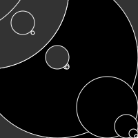
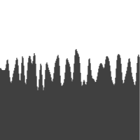

# Max's Sketches

## Fibonacci
[fibonacci 1](Max/fib_01.pv)
[fibonacci 2](Max/fib_02.pv)
[fibonacci 3](Max/fib_03.pv)
[fibonacci 4](Max/fib_04.pv)
[fibonacci 5](Max/fib_05.pv)
[fibonacci 6](Max/fib_06.pv)
[random 1](Max/schets_random_01.pv)
[random 2](Max/schets_random_02.pv)
[random 3](Max/schets_random_03.pv)
[random 4](Max/schets_random_04.pv)
[random 5](Max/schets_random_05.pv)
 [perlin 1](Max/perlinnoise_01.pv)
[perlin 2](Max/perlinnoise_02.pv)
[perlin 3](Max/perlinnoise_03.pv)
[perlin 4](Max/perlinnoise_04.pv)
[perlin 5](Max/perlinnoise_05.pv)
[perlin 6](Max/perlinnoise_06.pv)
[perlin 7](Max/perlinnoise_07.pv)

## Perlin Noise

## Recursive functions
            
