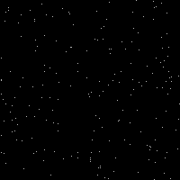
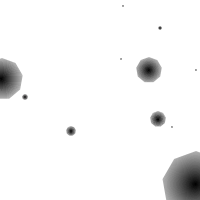

# Max's Sketches

## Fibonacci
[fibonacci 1](Max/fib_01.png)
[fibonacci 2](Max/fib_02.png)
[fibonacci 3](Max/fib_03.png)
[fibonacci 4](Max/fib_04.png)
[fibonacci 5](Max/fib_05.png)
[fibonacci 6](Max/fib_06.png)
[random 1](Max/schets_random_01.png)
[random 2](Max/schets_random_02.png)
[random 3](Max/schets_random_03.png)
[random 4](Max/schets_random_04.png)
[random 5](Max/schets_random_05.png)

## Perlin Noise

## Recursive functions
            
