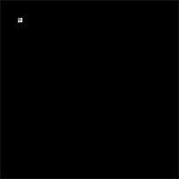
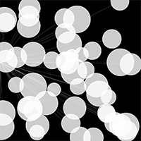
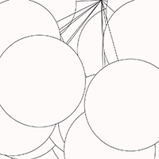

# Niels' schetsen
## Fibonacci

[Fibonacci 1](Fibonacci oval 2.pv)

[Fibonacci 2](Fibonacci oval.pv)

[Fibonacci 3](Fibonacci rec 4.pv)

[Fibonacci 4](Fibonacci text.pv)

[Fibonacci 5](variables 1.pv)

[Fibonacci 6](Fibonacci schets 15.pv)

[Fibonacci 7](Fibonacci schets 14.pv)

[Fibonacci 8](Fibonacci schets 12.pv)

[Fibonacci 9](Fibonacci schets 11.pv)

[Fibonacci 10](Fibonacci schets 10.pv)

[Fibonacci 11](Fibonacci schets 9.pv)

[Fibonacci 12](Fibonacci rec 5.pv)

## Random

[Random 1](random1.pv)

[Random 2](random2.pv)

[Random 3](random4.pv)

[Random 4](random5.pv)

[Random 5](random6.pv)

[Random 6](random color.pv)

[Random 7](random text.pv)

## PerlinNoise

[PerlinNoise 1](schets1.pv)

[PerlinNoise 2](schets2.pv)

[PerlinNoise 3](schets3 .pv)

[PerlinNoise 4](schets4.pv)

[PerlinNoise 5](schets5.pv)

## recursiveFunction

[recursiveFunction 1](rl schets1.pv)

[recursiveFunction 2](rl schets 2.pv)

[recursiveFunction 3](rl schets 3.pv)

[recursiveFunction 4](rl schets 6.pv)

[recursiveFunction 5](rl schets 7.pv)

