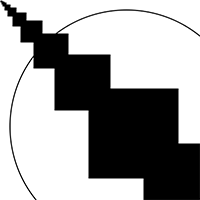
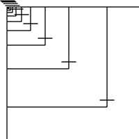

# Nikki G's Sketches
  
## Fibonacci
<!---->

[Klik Hier 1](Nikki_G/Fibonacci/fibonacci_2.pv)

[Klik Hier 2](Nikki_G/Fibonacci/fibonacci_1.pv)

[Klik Hier 3](Nikki_G/Fibonacci/fibonacci_3.pv)

[Klik Hier 4](Nikki_G/Fibonacci/fibonacci_4.pv)

[Klik Hier 5](Nikki_G/Fibonacci/fibonacci_5.pv)
     

## Random

[Klik Hier 1](Nikki_G/Random/Random_1.pv)

[Klik Hier 2](Nikki_G/Random/Random_2.pv)

[Klik Hier 3](Nikki_G/random/random_3.pv)

[Klik Hier 4](Nikki_G/Random/random_4.pv)

[Klik Hier 5](Nikki_G/Random/random_5.pv)

     

## Perlin Noise

[Klik Hier 1](Nikki_G/Perlin/Perlin_1.pv)

[Klik Hier 2](Nikki_G/Perlin/Perlin_3.pv)

[Klik Hier 3](Nikki_G/Perlin/Perlin_5.pv)

[Klik Hier 4](Nikki_G/Perlin/Perlin_6.pv)

[Klik Hier 5](Nikki_G/Perlin/Perlin_7.pv)

     

## Recursive functions

[Klik Hier 1](Nikki_G/recursive/recursice_2.pv)

[Klik Hier 2](Nikki_G/recursive/recursive_3.pv)            

[Klik Hier 3](Nikki_G/recursive/recursive_4.pv)

[Klik Hier 4](Nikki_G/recursive/recursive_5.pv)

[Klik Hier 5](Nikki_G/recursive/recursive_6.pv)