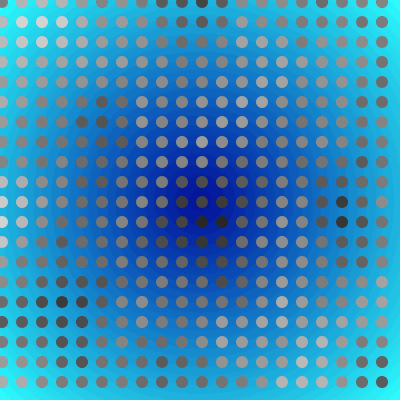
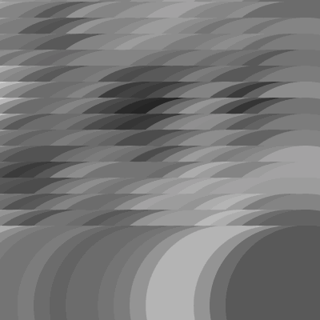

# Reinier's Sketches 

## Fibonacci

[sketch 1](1_Reinier/fibo/sketch1.pv)

[sketch 3](1_Reinier/fibo/sketch2.pv)

## Random

[sketch 1](2_Reinier/random/sketch1_random.pv)

[sketch 2](2_Reinier/random/sketch2.pv)
## Perlin Noise

[sketch 1](Reinier/3_pn/pn_sketch_1.pv)

[sketch 2](Reinier/3_pn/pn_sketch_2.pv)

[sketch 3](Reinier/3_pn/pn_sketch_3.pv)

## Recursive functions
            
