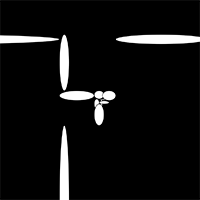
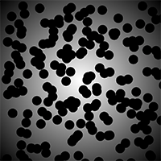
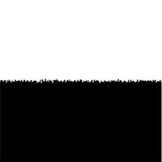
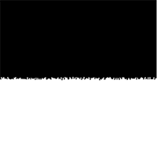
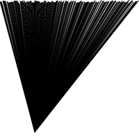

# Reinier's Sketches 

## Fibonacci

[sketch 1](1_Reinier/fibo/sketch1.pv)
[sketch 2](1_Reinier/fibo/sketch2.pv)
[sketch 3](1_Reinier/fibo/sketch3.pv)
[sketch 4](1_Reinier/fibo/sketch4.pv)
[sketch 5](1_Reinier/fibo/sketch5.pv)
[sketch 6](1_Reinier/fibo/sketch6.pv)

## Random

[sketch 1](2_Reinier/random/sketch1_random.pv)
[sketch 2](2_Reinier/random/sketch2_random.pv)
[sketch 3](2_Reinier/random/sketch3_random.pv)
[sketch 4](2_Reinier/random/sketch4_random.pv)
[sketch 5](2_Reinier/random/sketch5_random.pv)
[sketch 6](2_Reinier/random/sketch6_random.pv)

## Perlin Noise

[sketch 1](Reinier/3_pn/pn_sketch_1.pv)
[sketch 2](Reinier/3_pn/pn_sketch_2.pv)
[sketch 3](Reinier/3_pn/pn_sketch_3.pv)
[sketch 4](Reinier/3_pn/pn_sketch_4.pv)
[sketch 5](Reinier/3_pn/pn_sketch_5.pv)
[sketch 6](Reinier/3_pn/pn_sketch_6.pv)

## Recursive functions

[sketch 1](Reinier/4_rf/rf_sketch_1.pv)
[sketch 2](Reinier/4_rf/rf_sketch_2.pv)
[sketch 3](Reinier/4_rf/rf_sketch_3.pv)
[sketch 4](Reinier/4_rf/rf_sketch_4.pv)
[sketch 5](Reinier/4_rf/rf_sketch_5.pv)
[sketch 6](Reinier/4_rf/rf_sketch_6.pv)            
