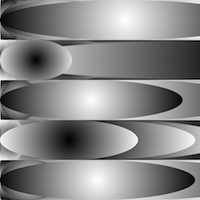
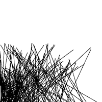
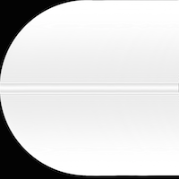
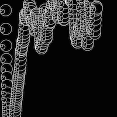

# Shirin's Sketches

## Fibonacci

[drawing 1](Shirin/plotdevice/drawing1.pv)

[drawing 2](Shirin/plotdevice/drawing2.pv)

[drawing 3](Shirin/plotdevice/drawing3.pv)

[drawing 4](Shirin/plotdevice/drawing4.pv)

[drawing 5](Shirin/plotdevice/drawing5.pv)
## Random

[drawing 1](Shirin/random/1.pv) 

[drawing 2](Shirin/random/2.pv) 

[drawing 3](Shirin/random/3.pv) 

[drawing 4](Shirin/random/4.pv) 

[drawing 5](Shirin/random/5.pv)

## Perlin Noise

[drawing 1](Shirin/noise/drawing1.pv) 

[drawing 2](Shirin/noise/drawing2.pv) 

[drawing 3](Shirin/noise/drawing3.pv) 

[drawing 4](Shirin/noise/drawing4.pv) 

[drawing 5](Shirin/noise/drawing5.pv)

## Recursive functions

[drawing 1](Shirin/rf/2.pv) 

[drawing 2](Shirin/rf/3.pv) 

[drawing 3](Shirin/rf/4.pv) 

[drawing 4](Shirin/rf/5.pv)  

[drawing 5](Shirin/rf/6.pv)        
