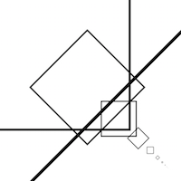
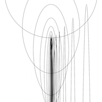

# Sietske's Sketches

## Fibonacci

[drawing 1](Sietske/fibonacci/06_drawing_fibonacci_oval01.pv)

[drawing 2](Sietske/fibonacci/06_drawing_fibonacci_oval05.pv)

[drawing 3](Sietske/fibonacci/06_drawing_fibonacci_rect02.pv)

[drawing 4](Sietske/fibonacci/06_drawing_fibonacci_rect03.pv)

[drawing 5](Sietske/fibonacci/06_drawing_fibonacci_squares.pv)

[drawing 6](Sietske/fibonacci/06_drawing_fibonacci_wolkje04.pv)

## Perlin Noise

[drawing 1](Sietske/PerlinNoise/01.pv)

[drawing 2](Sietske/PerlinNoise/02.pv)

[drawing 3](Sietske/PerlinNoise/03.pv)

## Recursive functions
            
