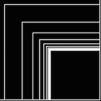
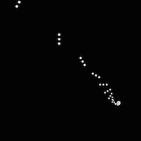
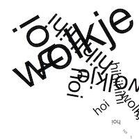
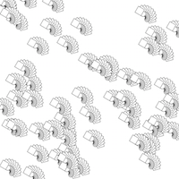

# Sietske's Sketches

## Fibonacci

[drawing 1](Sietske/fibonacci/06_drawing_fibonacci_oval01.pv)

[drawing 2](Sietske/fibonacci/06_drawing_fibonacci_oval05.pv)

[drawing 3](Sietske/fibonacci/06_drawing_fibonacci_rect02.pv)

[drawing 4](Sietske/fibonacci/06_drawing_fibonacci_rect03.pv)

[drawing 5](Sietske/fibonacci/06_drawing_fibonacci_squares.pv)

[drawing 6](Sietske/fibonacci/06_drawing_fibonacci_wolkje04.pv)

## Perlin Noise

####Random

[drawing 1](Sietske/PerlinNoise/random-01.pv)

[drawing 2](Sietske/PerlinNoise/random-02.pv)

[drawing 3](Sietske/PerlinNoise/random-03.pv)

[drawing 4](Sietske/PerlinNoise/random-04.pv)

[drawing 5](Sietske/PerlinNoise/random-05.pv)

####Perlin noise

[drawing 1](Sietske/PerlinNoise/PerlinNoise-01.pv)

[drawing 2](Sietske/PerlinNoise/PerlinNoise-02.pv)

[drawing 3](Sietske/PerlinNoise/PerlinNoise-03.pv)

[drawing 4](Sietske/PerlinNoise/PerlinNoise-04.pv)

[drawing 5](Sietske/PerlinNoise/PerlinNoise-05.pv)

## Recursive functions

[drawing 1](Sietske/recursiveFunctions/recursiveFunctions-Sketch01.pv)

[drawing 2](Sietske/recursiveFunctions/recursiveFunctions-Sketch02.pv)

[drawing 3](Sietske/recursiveFunctions/recursiveFunctions-Sketch03.pv)

[drawing 4](Sietske/recursiveFunctions/recursiveFunctions-Sketch04.pv)

[drawing 5](Sietske/recursiveFunctions/recursiveFunctions-Sketch05.pv)

          
