# Swaan's Sketches

## Fibonacci
<!---->
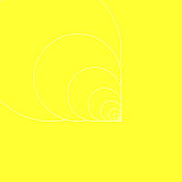
[drawing1](Swaan/test.pv)
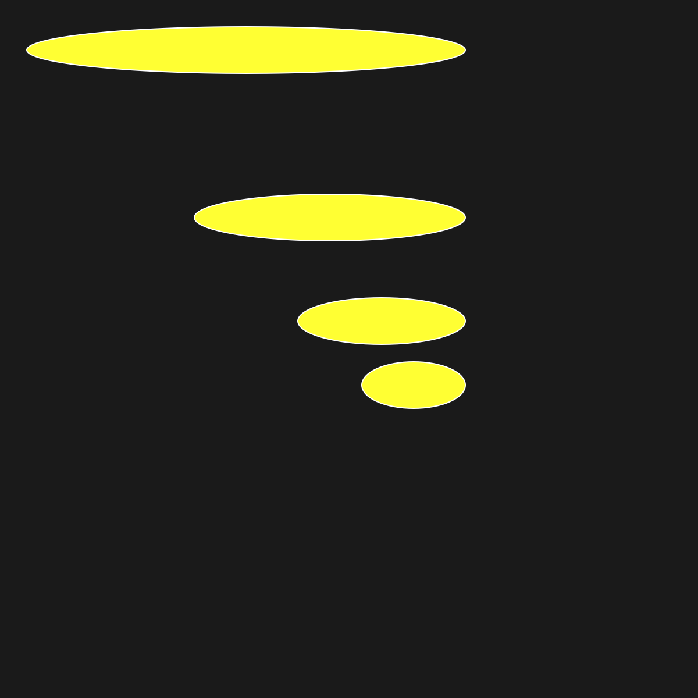
[drawing2](Swaan/test2.pv)
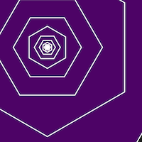
[drawing3](Swaan/test6.pv)
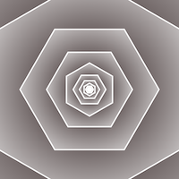
[drawing4](Swaan/test7.pv)
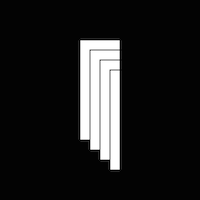
[drawing5](Swaan/test.pv)

## Random
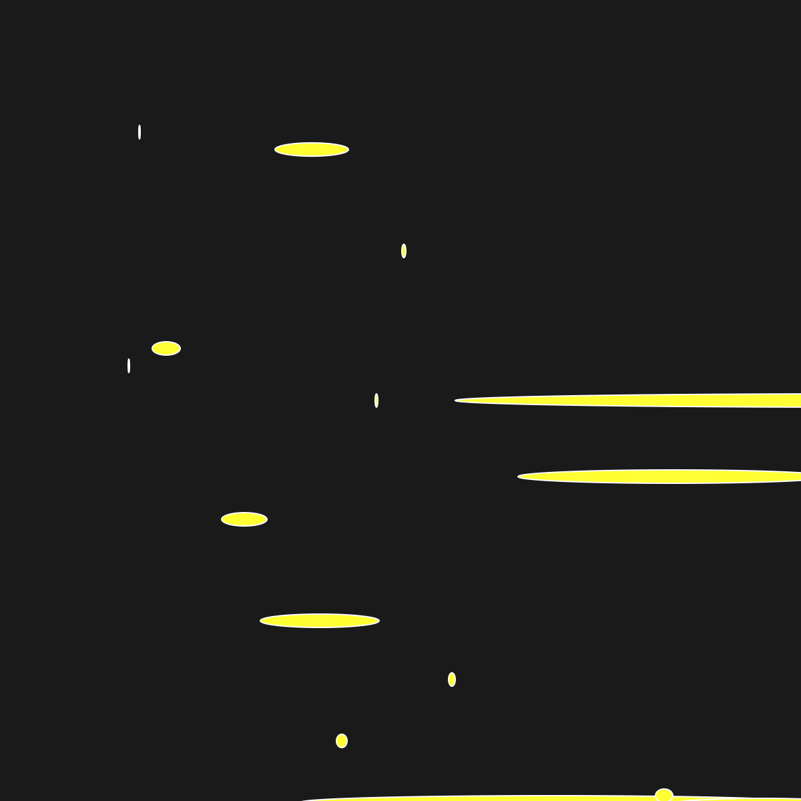
[drawing1](Swaan/test3.pv)
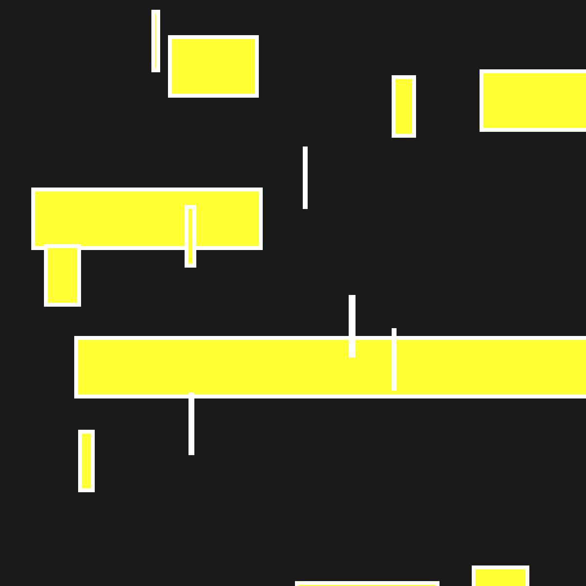
[drawing2](Swaan/test4.pv)
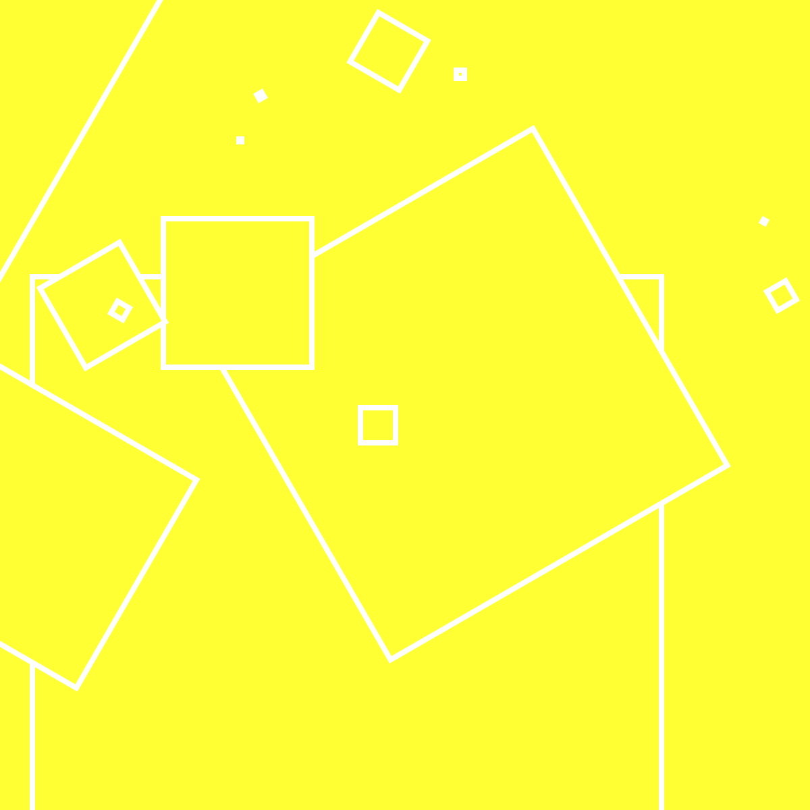
[drawing3](Swaan/test5.pv)
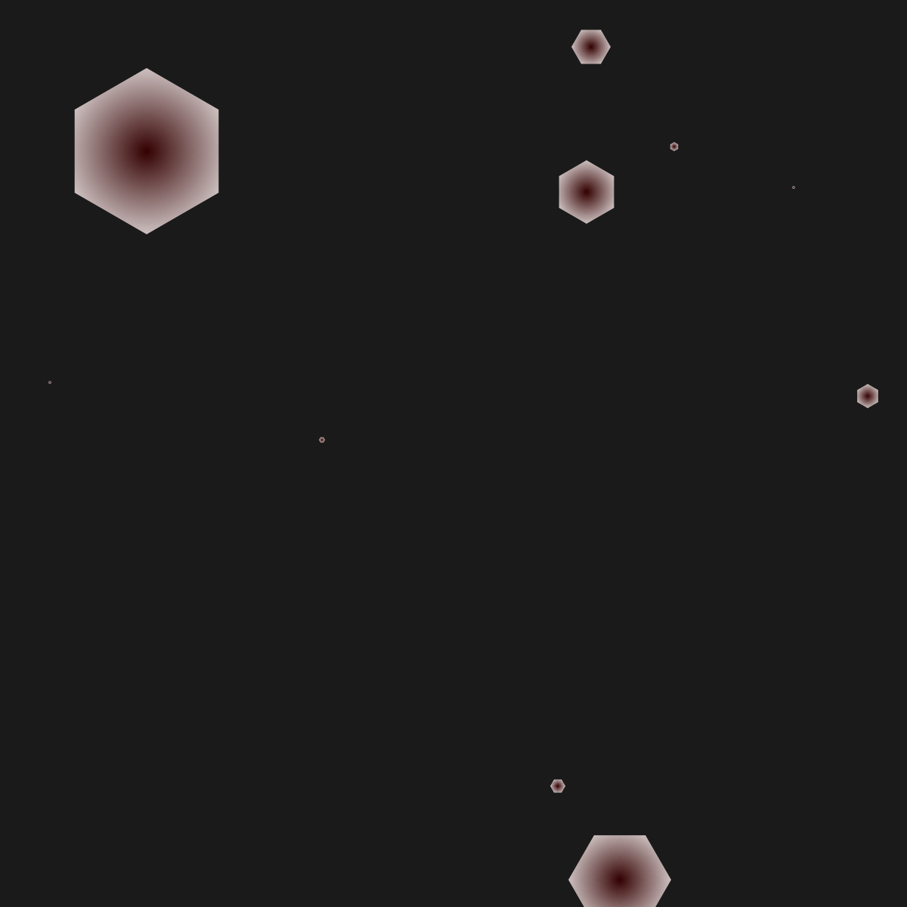
[drawing4](Swaan/test8.pv)
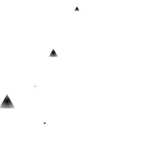
[drawing5](Swaan/test10.pv)

## Perlin Noise
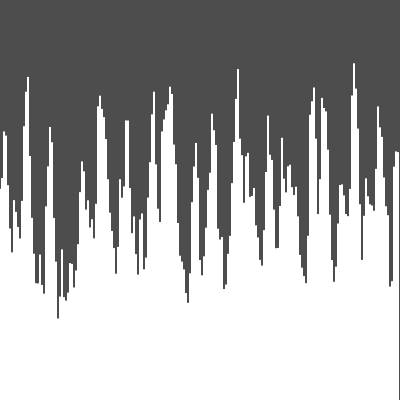
[drawing1](Swaan/perlinnoise1.pv)
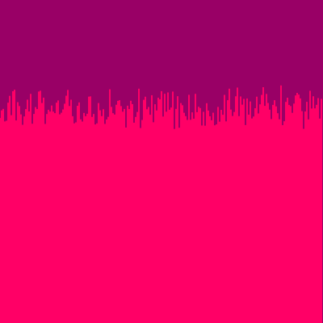
[drawing2](Swaan/perlinnoise2.pv)
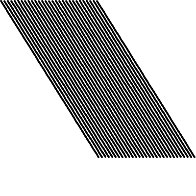
[drawing3](Swaan/perlinnoise3.pv)
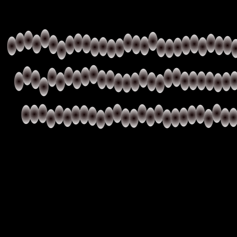
[drawing4](Swaan/perlinnoise4.pv)
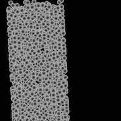
[drawing4.1](Swaan/perlinnoise4.pv)
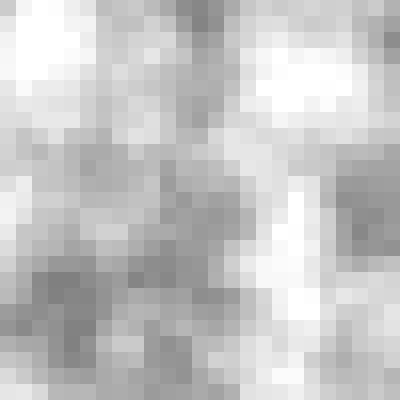
[drawing5](Swaan/perlinnoise5.pv)

## Recursive functions
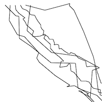
[drawing1](Swaan/recursivefunctions1.pv)
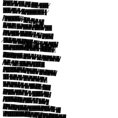
[drawing2](Swaan/recursivefunctions2.pv)
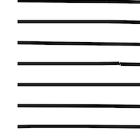
[drawing3](Swaan/recursivefunctions3.pv)
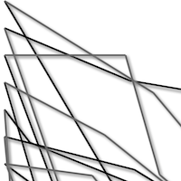
[drawing4](Swaan/recursivefunctions4.pv)
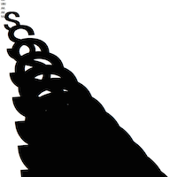
[drawing5](Swaan/recursivefunctions5.pv)
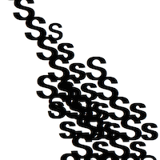
[drawing6](Swaan/recursivefunctions6.pv)
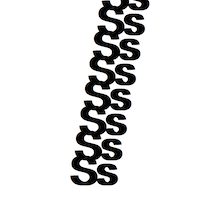
[drawing7](Swaan/recursivefunctions7.pv)
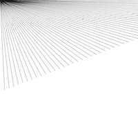
[drawing8](Swaan/recursivefunctions8.pv)
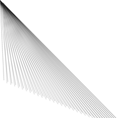
[drawing9](Swaan/recursivefunctions9.pv)
          
